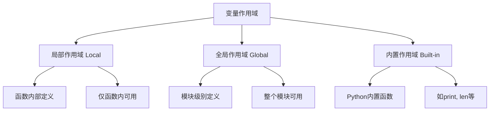

# Python 变量知识点总结

> 基于 W3School Python 变量章节内容整理

## 📋 目录
- [一、变量定义](#一变量定义)
- [二、变量命名规则](#二变量命名规则)
- [三、数据类型](#三数据类型)
- [四、变量作用域](#四变量作用域)
- [五、高级特性](#五高级特性)
- [六、总结](#六总结)

---

## 一、变量定义

### 基本概念
在Python中，变量是存储数据值的容器，无需预先声明类型，赋值即创建。

```python
# 变量定义示例
x = 10           # 整数变量
name = "Alice"   # 字符串变量
is_valid = True  # 布尔变量
pi = 3.14        # 浮点数变量
```

### 动态类型特性
Python是动态类型语言，同一变量可被重新赋值为不同类型的值：

```python
x = 10      # x 是整数
print(f"x的类型: {type(x)}, 值: {x}")

x = "hi"    # x 变为字符串
print(f"x的类型: {type(x)}, 值: {x}")

x = [1, 2, 3]  # x 变为列表
print(f"x的类型: {type(x)}, 值: {x}")
```

**特点总结：**
- ✅ 无需类型声明
- ✅ 动态类型，灵活可变
- ✅ 赋值即创建
- ✅ 类型由值决定

---

## 二、变量命名规则

### 命名规范

| 规则 | 示例 | 说明 |
|------|------|------|
| **必须以字母或下划线开头** | `name`, `_count` | ❌ `2name` 非法 |
| **只能包含字母、数字、下划线** | `user_age`, `total2` | ❌ `my-name` 非法 |
| **区分大小写** | `age`, `Age`, `AGE` | 三个不同变量 |
| **不能使用关键字** | ✅ `username` | ❌ `class` 非法 |
| **建议描述性命名** | ✅ `user_age` | ❌ `ua` 不推荐 |

### 合法与非法命名示例

```python
# ✅ 合法命名
name = "Tom"
_user = "admin"
total_count2 = 100
MAX_SIZE = 1000

# ❌ 非法命名
# 2name = "错"        # 数字开头
# my-name = "错"      # 含减号
# class = "错"        # 关键字
# for = "错"         # 关键字
```

### Python关键字列表
```python
import keyword
print(keyword.kwlist)
# 输出：['False', 'None', 'True', 'and', 'as', 'assert', 'async', 'await', 
#        'break', 'class', 'continue', 'def', 'del', 'elif', 'else', 'except',
#        'finally', 'for', 'from', 'global', 'if', 'import', 'in', 'is',
#        'lambda', 'nonlocal', 'not', 'or', 'pass', 'raise', 'return',
#        'try', 'while', 'with', 'yield']
```

---

## 三、数据类型

### 数据类型概览表

| 数据类型 | 类别 | 示例 | 可变性 | 说明 |
|----------|------|------|--------|------|
| **int** | 数值型 | `x = 10` | 不可变 | 整数 |
| **float** | 数值型 | `y = 3.14` | 不可变 | 浮点数 |
| **str** | 序列型 | `s = "hello"` | 不可变 | 字符串 |
| **bool** | 布尔型 | `is_true = True` | 不可变 | 逻辑值 |
| **list** | 序列型 | `lst = [1, 2, 3]` | 可变 | 有序列表 |
| **tuple** | 序列型 | `tup = (1, 2, 3)` | 不可变 | 元组 |
| **dict** | 映射型 | `d = {"name": "Alice"}` | 可变 | 字典 |
| **set** | 集合型 | `s = {1, 2, 3}` | 可变 | 无序集合 |

### 类型检测与转换

```python
# 使用 type() 检测类型
print(type(10))        # <class 'int'>
print(type("Hi"))      # <class 'str'>
print(type([1,2,3]))   # <class 'list'>

# 类型转换示例
num_str = "123"
num_int = int(num_str)     # 字符串转整数
num_float = float(num_str) # 字符串转浮点数
str_num = str(123)         # 数字转字符串
```

---

## 四、变量作用域

### 作用域层次结构



### 1. 局部作用域（Local）

```python
def my_func():
    local_var = "我在函数内"  # 局部变量
    print(local_var)         # ✅ 可访问

my_func()
# print(local_var)           # ❌ 报错：NameError
```

### 2. 全局作用域（Global）

```python
global_var = "我是全局变量"  # 全局变量

def my_func():
    print(global_var)        # ✅ 可访问全局变量

my_func()
print(global_var)            # ✅ 也可访问
```

### 3. global关键字使用

```python
x = "全局初始值"

def change_global():
    global x                 # 声明使用全局变量x
    x = "被修改后的值"       # 修改全局变量

def create_local():
    x = "局部变量"          # 创建同名局部变量
    print(f"函数内: {x}")   # 输出: 函数内: 局部变量

print(f"修改前: {x}")       # 输出: 修改前: 全局初始值
change_global()
print(f"修改后: {x}")       # 输出: 修改后: 被修改后的值

create_local()
print(f"函数外: {x}")       # 输出: 函数外: 被修改后的值
```

### 作用域优先级

```python
x = "global"  # 全局变量

def test():
    x = "local"   # 局部变量（优先级更高）
    print(f"函数内: {x}")  # 输出: local

test()
print(f"函数外: {x}")      # 输出: global（全局变量未变）
```

---

## 五、高级特性

### 1. 多变量赋值

```python
# 同时赋值不同值
a, b, c = 1, "hello", True
print(f"a={a}, b={b}, c={c}")

# 同时赋相同值
x = y = z = 0
print(f"x={x}, y={y}, z={z}")

# 交换变量值
x, y = 10, 20
x, y = y, x  # 交换
print(f"x={x}, y={y}")  # 输出: x=20, y=10
```

### 2. 变量输出与格式化

```python
name = "Tom"
age = 25

# 字符串拼接（需类型一致）
print("Hello " + name)                    # ✅ 正确
# print("Age: " + age)                    # ❌ 错误：类型不一致
print("Age: " + str(age))                 # ✅ 正确：转换类型

# 格式化输出（推荐）
print(f"姓名: {name}, 年龄: {age}")       # f-string (Python 3.6+)
print("姓名: {}, 年龄: {}".format(name, age))  # format方法
print("姓名: %s, 年龄: %d" % (name, age))      # %格式化
```

### 3. 变量内存管理

```python
import sys

# 查看变量内存占用
x = 1000
y = "Hello World"
z = [1, 2, 3, 4, 5]

print(f"x占用内存: {sys.getsizeof(x)} 字节")
print(f"y占用内存: {sys.getsizeof(y)} 字节") 
print(f"z占用内存: {sys.getsizeof(z)} 字节")

# 变量引用
list1 = [1, 2, 3]
list2 = list1  # list2引用同一个列表对象
list2.append(4)
print(f"list1: {list1}")  # 输出: [1, 2, 3, 4]
print(f"list2: {list2}")  # 输出: [1, 2, 3, 4]
```

---

## 六、总结

### 核心要点回顾

| 主题 | 关键点 | 注意事项 |
|------|--------|----------|
| **变量定义** | 动态类型，赋值即创建 | 无需类型声明 |
| **命名规则** | 字母/下划线开头，避免关键字 | 区分大小写 |
| **数据类型** | 8种主要类型，了解可变性 | 使用type()检测 |
| **作用域** | 局部 > 全局，global关键字 | 避免命名冲突 |
| **高级特性** | 多变量赋值，格式化输出 | 注意类型转换 |

### 最佳实践建议

1. **命名规范**：使用有意义的变量名，如`user_age`而非`ua`
2. **作用域管理**：合理使用局部和全局变量，避免污染全局命名空间
3. **类型安全**：注意类型转换，使用f-string进行格式化输出
4. **内存意识**：了解可变与不可变类型的区别
5. **代码可读性**：保持变量命名的一致性

---

> 本文档基于 W3School Python 教程整理，适用于 Python 3.x 版本

**📚 扩展学习建议：**
- 深入学习Python的数据结构（列表、字典、集合等）
- 了解面向对象编程中的实例变量和类变量
- 掌握Python的模块和包管理
- 学习Python的内存管理机制
